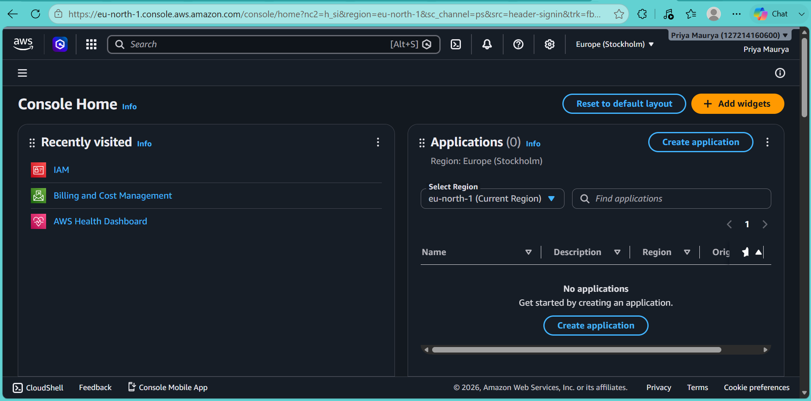
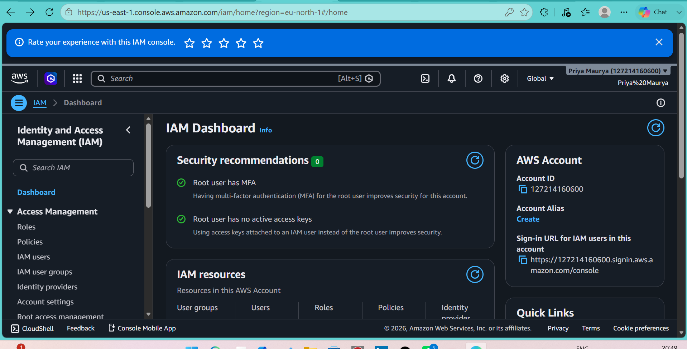
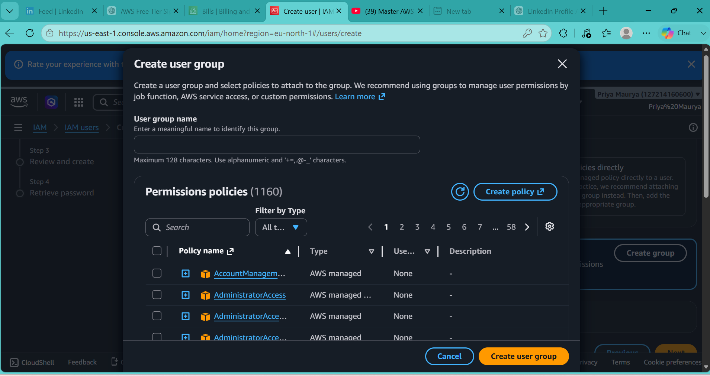
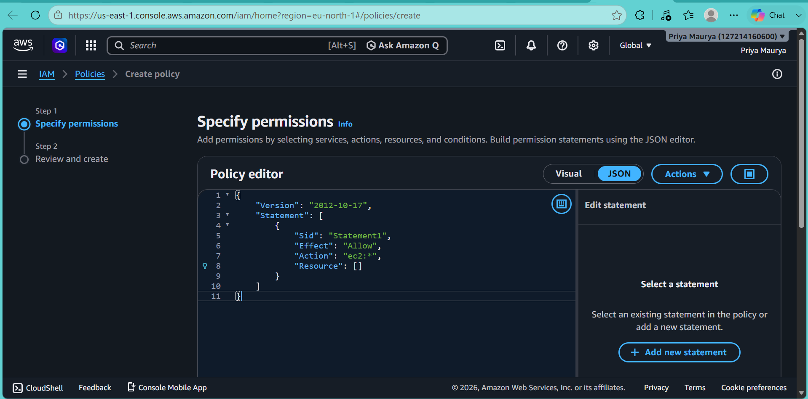
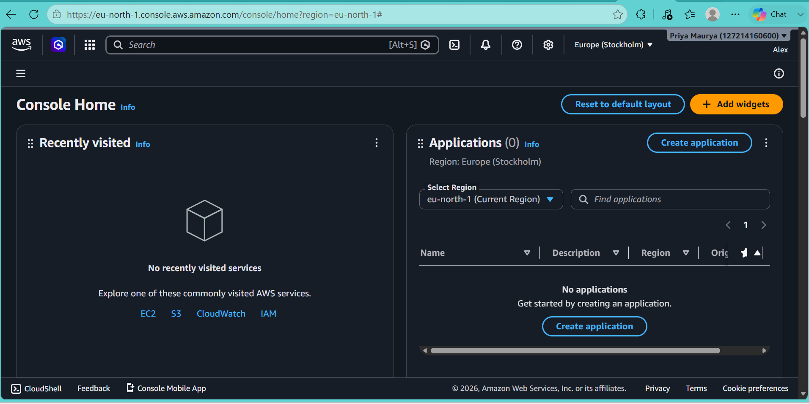

# AWS IAM User and Group Management

## Project Overview

This project demonstrates the practical implementation of AWS Identity and Access Management (IAM) by creating and managing IAM users, groups, permissions, and secure authentication.

The objective is to understand how AWS IAM helps organizations securely control access to AWS resources using the Principle of Least Privilege.

---

## Project Objectives

- Create an IAM Group
- Create an IAM User
- Assign the user to the group
- Attach appropriate permissions
- Generate console login credentials
- Verify user login
- Understand IAM security best practices
- CLI user login
---

## AWS Service Used

- AWS Identity and Access Management (IAM)

---

## Project Architecture


---

## Implementation Steps

### Step 1: Sign in to AWS Console

Logged in using the AWS Root Account.

---


### Step 2: Create an IAM User

Created a user named:

- Alex

Enabled:

- AWS Management Console Access

---
### Step 3: Create an IAM Group

Created a group named:

- Admin

---

### Step 4: Add User to Group

Added the IAM user **Alex** to the **Admin** group.

---

### Step 5: Assign Permissions

Attached the following AWS Managed Policy:

- AdministratorAccess

---

### Step 6: Generate Login Credentials

Generated:

- Console Login URL
- Username
- Temporary Password

---

### Step 7: Verify Login

Successfully logged in using the IAM User credentials.

---

### Step 8: Enable MFA

Configured Multi-Factor Authentication for enhanced account security.

---

## Screenshots

### AWS Console



---

### IAM Dashboard



---

### Create Group


---

### Create User


---

### Add User to Group



---

### Attach Policy



---

### Login as IAM User




---
## AWS CLI Verification

Verified the configured AWS CLI credentials using the following command:

## AWS CLI Verification

Verified the configured AWS CLI credentials using the following command:

```bash
aws sts get-caller-identity
```

This command confirms that the AWS CLI is authenticated as the IAM user **Alex**.

 

---

## Skills Demonstrated

- AWS IAM
- User Management
- Group Management
- IAM Policies
- Authentication
- Authorization
- Cloud Security
- Identity Management

---

## Learning Outcomes

Through this project, I learned how AWS IAM securely manages identities and permissions. I gained practical experience creating users and groups, assigning permissions using AWS Managed Policies, enabling MFA, and following AWS security best practices.

---

## Author

**Priya Maurya**

B.Tech Computer Science Engineering

Aspiring Cloud Security Engineer

GitHub: https://github.com/Priya-dev-hub
